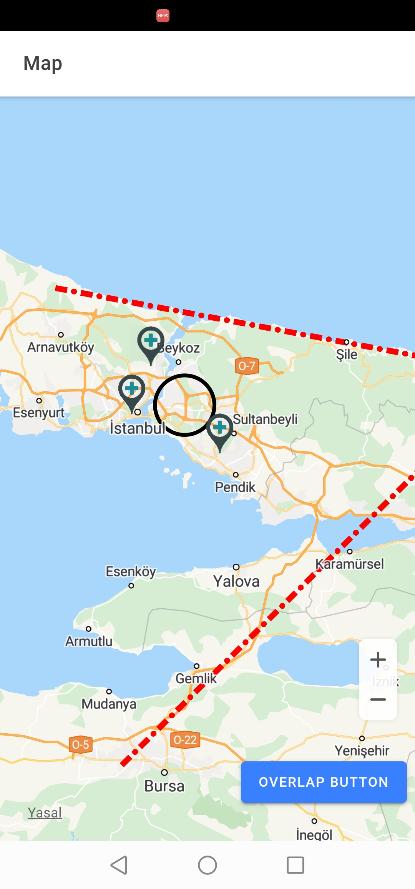
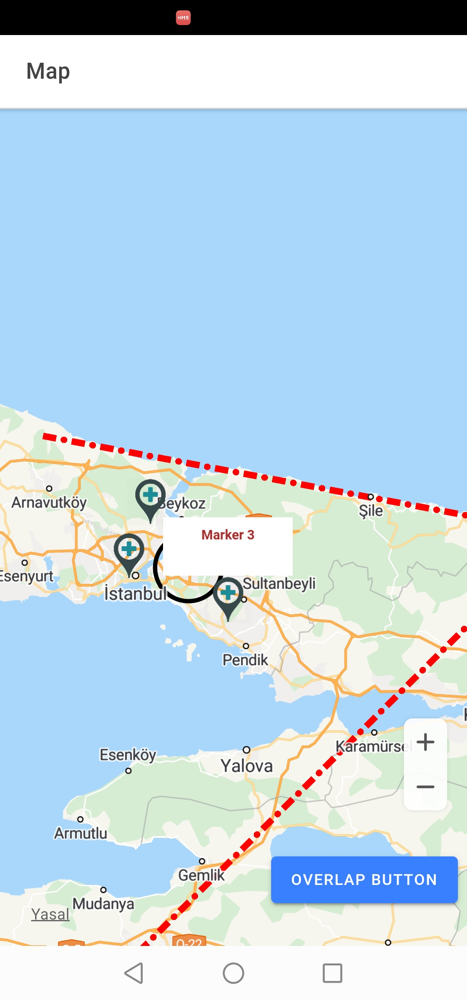
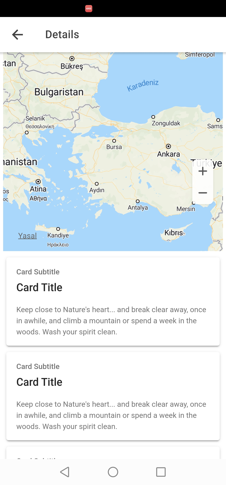

# HUAWEI HMS Map Ionic Sample Project 


## Introduction

This Project shows a sample usage of HMS Map Plugin version 5.1.0-300 in Ionic Platform. You can find detailed explanation in my [Medium story](https://medium.com/@tolunaykatirci/huawei-cordova-map-plugin-in-ionic-e0ab93f3dfe).

## Installation

**Step 1:** Make sure you have installed Node, npm and Ionic CLI in your computer.

**Step 2:** Install required tools.

```bash
npm install
```

**Step 3:** Update the widget **`id`** property which is specified in the **`config.xml`** file. It must be same with **package_name** value of the **`agconnect-services.json`** file.

- You should configure your app in **AppGallery** to get **`agconnect-services.json`** file.

**Step 4:** Add the **Android platform**.

```bash
ionic cordova platform add android
```

**Step 5:** Copy **`agconnect-services.json`** file to **`<project_root>/platforms/android/app`** directory.

**Step 6:** Add **`keystore(.jks)`** and **`build.json`** files to your project's root directory.

- You can refer to 3rd and 4th steps of [Generating a Signing Certificate](https://developer.huawei.com/consumer/en/codelab/HMSPreparation/index.html#2) Codelab tutorial page for generating keystore file.

- Fill **`build.json`** file according to your keystore information. For example:

```json
{
  "android": {
    "debug": {
      "keystore": "<keystore_file>.jks",
      "storePassword": "<keystore_password>",
      "alias": "<key_alias>",
      "password": "<key_password>"
    },
    "release": {
      "keystore": "<keystore_file>.jks",
      "storePassword": "<keystore_password>",
      "alias": "<key_alias>",
      "password": "<key_password>"
    }
  }
}
```

**Step 7:** Run the application.

```bash
ionic cordova run android --device
```

## Screenshots

  
